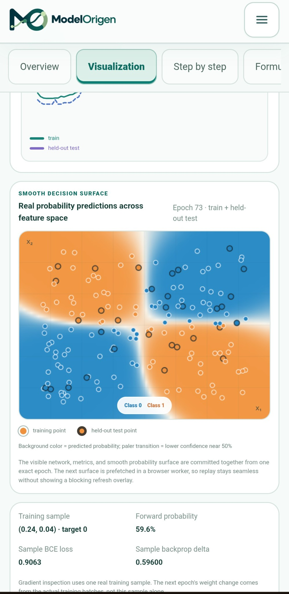
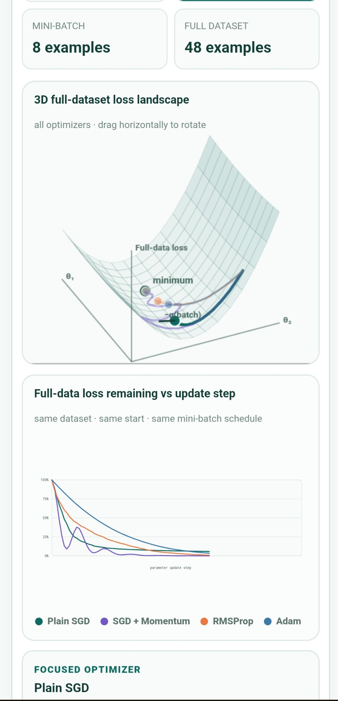
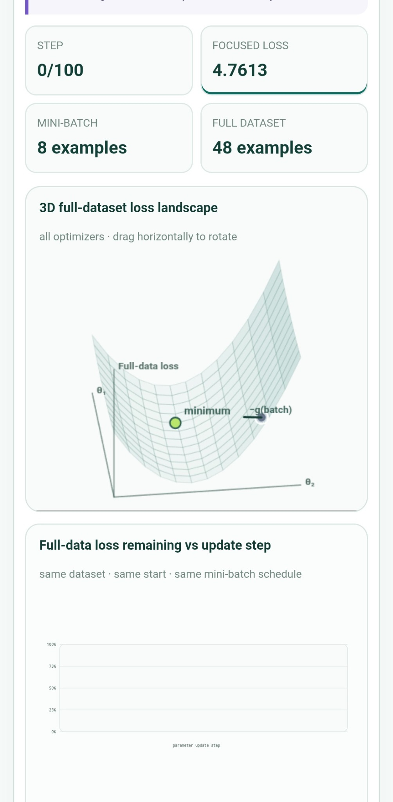
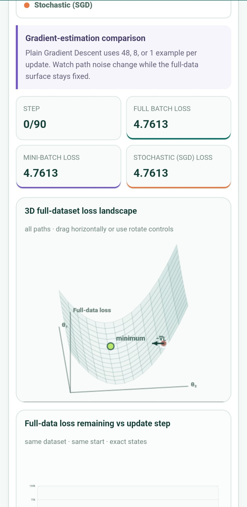
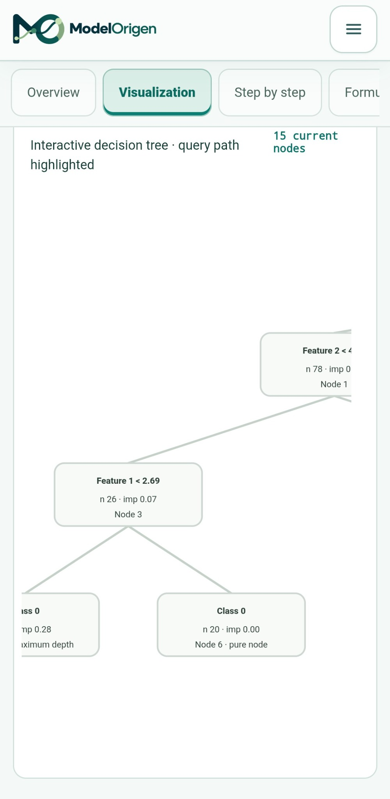

# ModelOrigen

**Interactive ML visualizer — see the real math, model state, predictions, loss, gradients, decisions, and evaluation evidence behind machine learning, live in your browser.**

## 🔗 Live: https://modelorigen.in

ModelOrigen is an interactive machine-learning education platform by **Origen Technologies**. It is built for learners who want to go beyond high-level explanations and inspect the real numbers, model states, predictions, and evaluation evidence behind machine-learning behavior.

This repository is intentionally a **public showcase only**. It contains no application source code, no implementation details, no internal architecture, and no build instructions.

---

## What ModelOrigen does

ModelOrigen lets learners interact with real datasets and inspect genuine model behavior across **classical machine learning, deep learning, model evaluation, data preparation, optimization, and Data & AI foundations**.

Depending on the lesson, a learner can inspect quantities such as a weighted sum, probability, prediction error, loss, gradient, parameter update, nearest-neighbor distance, split impurity, support-vector evidence, centroid movement, boosting stage, hidden state, attention weight, reconstruction, discriminator score, or held-out evaluation metric.

The goal is straightforward:

**change a meaningful input or parameter → observe the model → inspect the calculation → understand why the result changed**

---

## Classical machine-learning visualizers

| Model | What learners can inspect |
| --- | --- |
| **Linear Regression** | Predictions, residuals, loss, learned parameters, learning-rate effects, and train/test evidence. |
| **Logistic Regression** | Weighted sum `z`, sigmoid probability, threshold decision, sample loss, gradients, parameter updates, and decision-boundary movement. |
| **K-Nearest Neighbors (KNN)** | Query points, real distances, selected nearest neighbors, uniform or distance-weighted voting, and the effect of changing `K`. |
| **Decision Tree** | Candidate/selected splits, impurity, sample counts, tree growth, leaves, and the exact query path through the tree. |
| **Support Vector Machine (SVM)** | Margin geometry, support vectors, decision scores, kernel behavior, and parameter effects such as `C` and `gamma` where applicable. |
| **Random Forest** | Individual trees, ensemble behavior, tree-by-tree evidence, depth/estimator changes, and held-out predictions. |
| **Gradient Boosting** | Sequential boosting stages, remaining error, learning-rate sensitivity, accumulated learner contributions, and held-out evidence. |
| **AdaBoost** | Sample-weight changes, weak learners, mistakes that receive more emphasis, and the evolving ensemble decision. |
| **Extra Trees** | Randomized tree structures, ensemble diversity, depth/estimator changes, and aggregate predictions. |
| **XGBoost** | Stage-by-stage boosting evidence, regularized tree contributions, changing predictions, and evaluation behavior. |
| **K-Means** | Initial centroids, point-to-centroid assignments, centroid movement, inertia, and the real iteration sequence until stopping. |

ModelOrigen does **not** pretend every algorithm learns in the same way. The visualization is model-specific: KNN focuses on neighbors and distance, K-Means on assignment and centroid updates, tree models on splits and paths, SVM on margins and decision scores, and gradient-based models on numerical learning states.

---

## Deep-learning visualizers

ModelOrigen also includes focused interactive lessons for:

- **Artificial Neural Network / Multilayer Perceptron (ANN / MLP)** — genuine training states, sample-level forward probability, loss/backprop evidence, and smooth probability decision surfaces.
- **Convolutional Neural Network (CNN)** — convolution/filter behavior, feature maps, predictions, and held-out evidence.
- **Recurrent Neural Network (RNN)** — sequence processing and hidden-state trajectories over time.
- **LSTM** — gate behavior and memory-state evolution across a sequence.
- **GRU** — update/reset-gate behavior and hidden-state evolution.
- **Transformer Attention** — query-to-source relationships and normalized attention weights.
- **Autoencoder** — reconstruction behavior and an inspectable latent/bottleneck representation.
- **Generative Adversarial Network (GAN)** — real/generated points, discriminator confidence, generator movement, and changing adversarial evidence.

The emphasis remains educational: connect what is visible on-screen to the model evidence responsible for it, rather than treating the model as a black box.

---

## Data & AI foundations

ModelOrigen includes separate interactive labs for concepts that learners repeatedly meet in machine learning and data science:

- **Statistics & Probability** — sampling, sample means, spread, and standard error.
- **Principal Component Analysis (PCA)** — transformed coordinates, covariance/eigen-directions, explained variance, projection, and the effect of standardization.
- **Gradient Sampling** — full-batch, mini-batch, and stochastic gradient estimates on the same objective.
- **Optimizer Comparison** — Plain SGD, SGD + Momentum, RMSProp, and Adam on the same loss landscape.
- **Bias vs Variance** — how model complexity changes training and validation behavior.
- **Explainable AI** — inspect a prediction through model-derived feature evidence and local contributions.
- **Time Series** — chronological train/test separation, moving averages, lag relationships, and forecasting evidence.
- **Model Evaluation** — confusion matrix, accuracy, precision, recall, F1, specificity, ROC, precision-recall behavior, calibration, and Brier score.
- **Cross-Validation** — fold rotation, optional stratification, refitting, validation scores, and a separately protected final-test concept.
- **Data Cleaning** — missing values, duplicates, outliers, imputation, scaling, and categorical encoding as visible transformation steps.
- **Feature Engineering** — compare feature representations while keeping the learning problem and evidence traceable.
- **Probability & Bayes** — prior probability, likelihood, normalization, posterior probability, and odds-based reasoning.

---

## A broader learning workflow

ModelOrigen is not only a collection of isolated visualizers. It also supports workflows around:

**dataset → feature understanding → preprocessing → model choice → parameter change → training/replay evidence → prediction → evaluation → fair comparison**

Learners can inspect dataset behavior, feature effects, train/validation/test evidence, parameter changes, experiment comparisons, and project-style reasoning.

Where a concept does **not** have a meaningful iterative training loop, ModelOrigen does not invent one for decoration. Where a model does train iteratively, the learner can inspect genuine recorded states rather than pre-baked progress frames.

---

## Why it is different

### Real computed numbers, not pre-baked demo values

Values shown in the interactive experience are derived from the active dataset, selected point, chosen parameters, and the model state being inspected. The purpose is to help learners verify *why* a result changed, not simply watch a scripted animation.

### See the internal learning chain

For a model such as Logistic Regression, a learner can follow a real example through a chain such as:

**input → weighted sum → probability → loss → gradient → parameter change → new prediction**

Other algorithms show their own model-specific evidence rather than being forced into this same template.

### Browser-side privacy

Model training and educational calculations are designed to happen in the browser. Local learning data stays on the learner’s device instead of being uploaded for server-side model training.

### Built for understanding, not benchmark theater

ModelOrigen is an educational product. It does not treat one visual boundary, one toy dataset, or one accuracy number as proof that a model is “best.” Training and held-out evidence are kept distinct where that distinction matters.

### Change one thing and inspect the consequence

A learner can change a meaningful parameter, dataset condition, feature choice, split, or optimizer setting and inspect the resulting change in the model’s actual recorded evidence.

---

## Screenshots

### Logistic Regression — actual sigmoid calculation

A real recorded state connects `z`, `sigmoid(z)`, the decision threshold, and the resulting prediction.

### ANN / MLP — smooth probability decision surface

The background represents predicted probability across feature space while training and held-out points remain visible.

### Optimizers — 3D loss landscape and convergence comparison

Compare optimizer paths and full-dataset loss behavior while keeping the learning objective visible.

### Decision Tree — interactive query path

Inspect the tree structure and follow the nodes used by a selected query.

### Time Series — chronological evidence

Observe time-ordered data, smoothing, and the chronological train/test boundary.

---

## Who it is for

ModelOrigen is built for:

- **Students learning machine learning for the first time** who want to connect equations with visible model behavior.
- **Self-taught learners** who found many explainers useful at the overview level but still wanted to see the numbers inside a real example.
- **Learners studying data science or ML** who want stronger intuition around models, metrics, optimization, preprocessing, and evaluation.
- **Anyone who wants to verify intuition against computed evidence** instead of trusting a black-box animation or an unexplained final score.

---

## Explore ModelOrigen

### 🔗 https://modelorigen.in

Try a model, change one thing, inspect the calculation, and follow the evidence.

ModelOrigen is built by **Origen Technologies**.

---

## About this repository

This repository is a **public product showcase and discovery page** for ModelOrigen.

It intentionally does **not** contain:

- application source code;
- model or training implementation code;
- internal architecture or file structure;
- build or deployment configuration;
- internal documentation;
- local installation instructions;
- implementation-level technical details.

The live product is the authoritative place to use ModelOrigen.

---

**© Origen Technologies. All rights reserved. This repository is a public showcase; the ModelOrigen application source code is closed and is not included here.**
